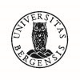

```{r setup_letter_participant_reminder_sample1, echo = FALSE, warning = FALSE, message = FALSE}
if(!require("readxl")){install.packages("readxl");  library(readxl)}
if(!require("tidyverse")){install.packages("tidyverse");  library(tidyverse)}

d <- read_excel("C://Users/svein/Documents/borgerpanel/Data/DeliberativePoll-planning.xlsx")
knitr::opts_chunk$set(echo = FALSE, knitr.kable.NA = "", warning = FALSE, message = FALSE)

```


Kjære **fornavn** **etternavn**

Vi minner om din unike sjanse til å være med som deltaker i den deliberative meningsmålingen den 12. juni.
Kanskje du hørte om arrangementet på NRK Hordaland i deres morgensending tirsdag 25. mai?

Vi oppfordrer deg til å registrere deg dersom du ikke allerede har gjort det.

For å sikre at flest mulig interesserte melder seg på øker vi honoraret fra kr. 500 til kr. 1000 for alle som fullfører deltakelsen. 
Vi har også utvidet påmeldingsfristen til 4. juni.
Dersom vi når maks antall deltakere før denne datoen vil påmeldingen stenges tidligere.

Nå har du sjansen til å påvirke politikken i byen i mellom valg, og vi oppfordrer deg til å benytte deg av denne muligheten.
Gå inn på denne nettsiden for å registrere deg som deltaker: https://nettskjema.no/a/183040

Når du har registrert deg vil du senere få en epost med mer informasjon.
Obs: I påmeldingen er det viktig at du oppgir dette nummeret, som er ditt referansenummer: **ID**

Dersom du allerede har registrert deg eller ikke ønsker å delta kan du se bort fra denne påminnelsen.
Ved spørsmål kan du kontakte faglig leder Sveinung Arnesen på epost sarn@norceresearch.no.

Med vennlig hilsen

Ingrid Helgøy

{height='80'}     .       {height='30'}  
{height='60'}    .      {height='20'}
