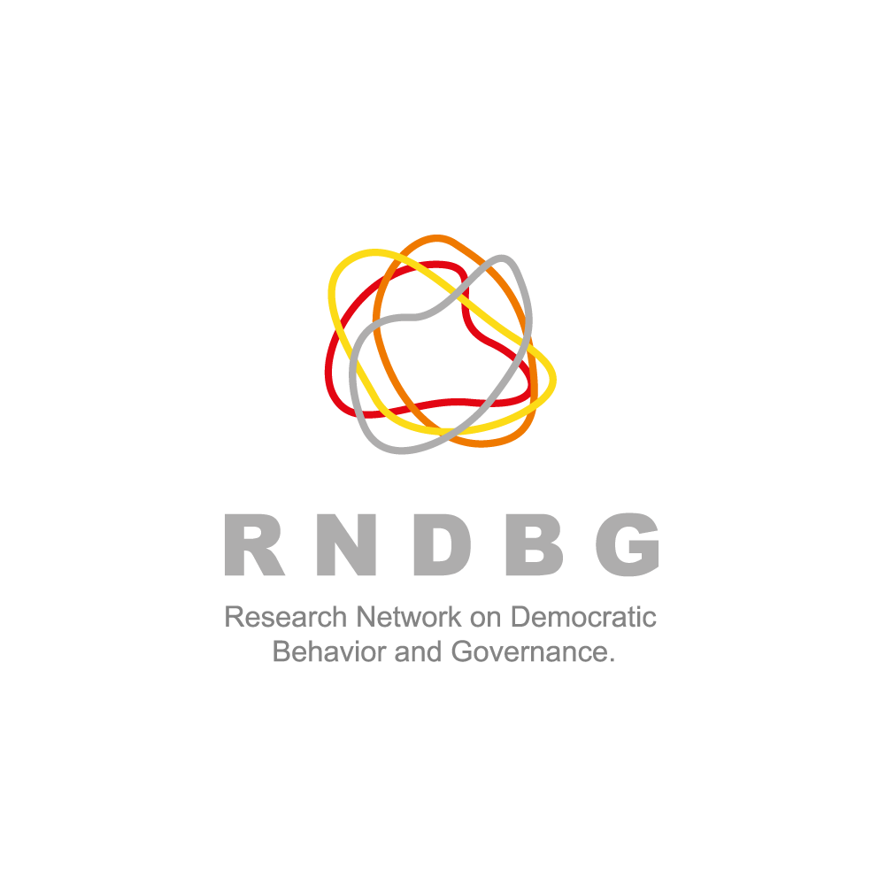
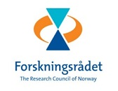
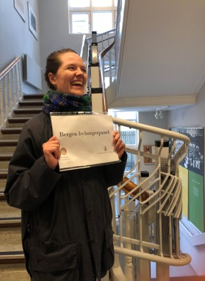
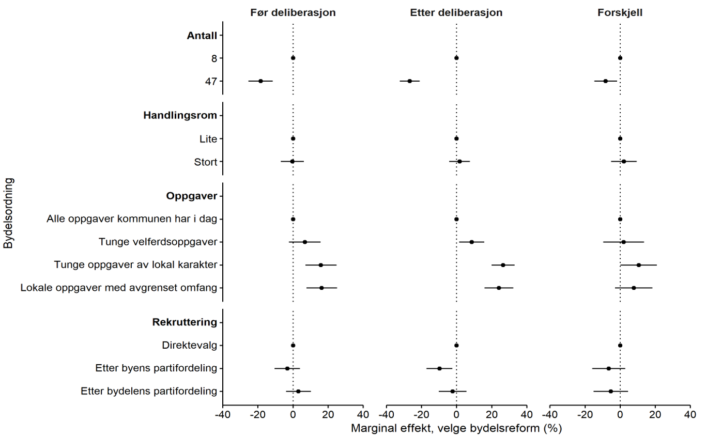
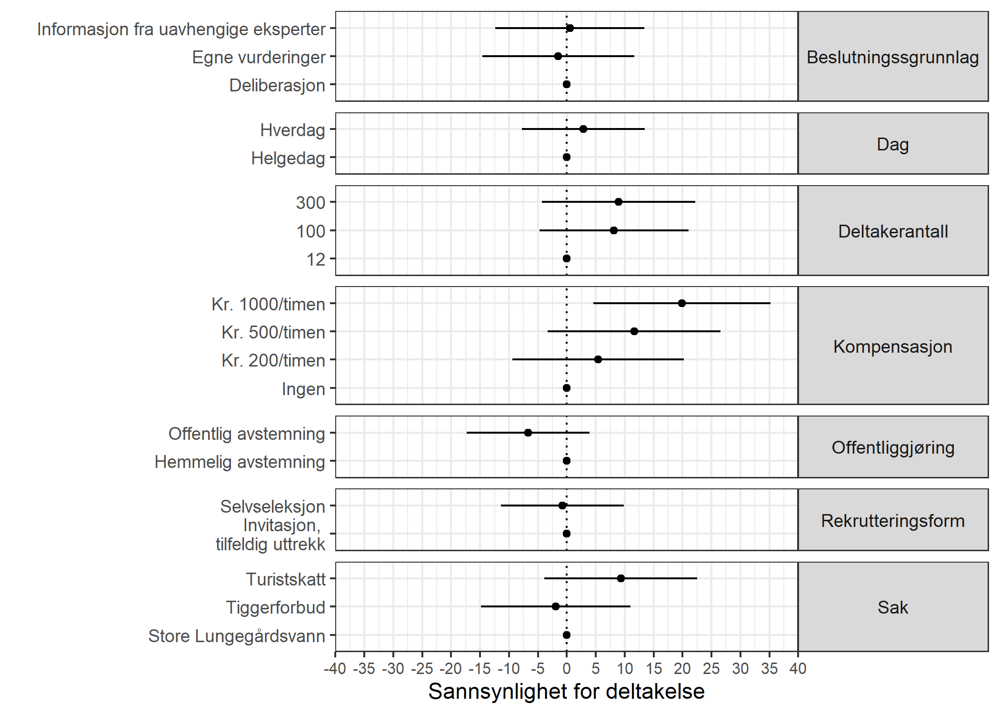
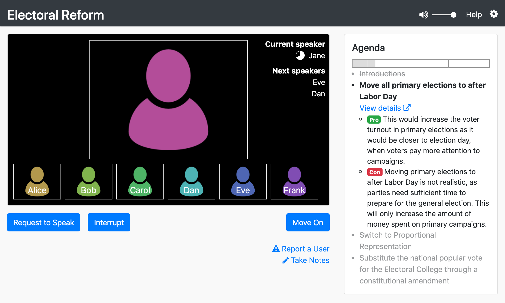
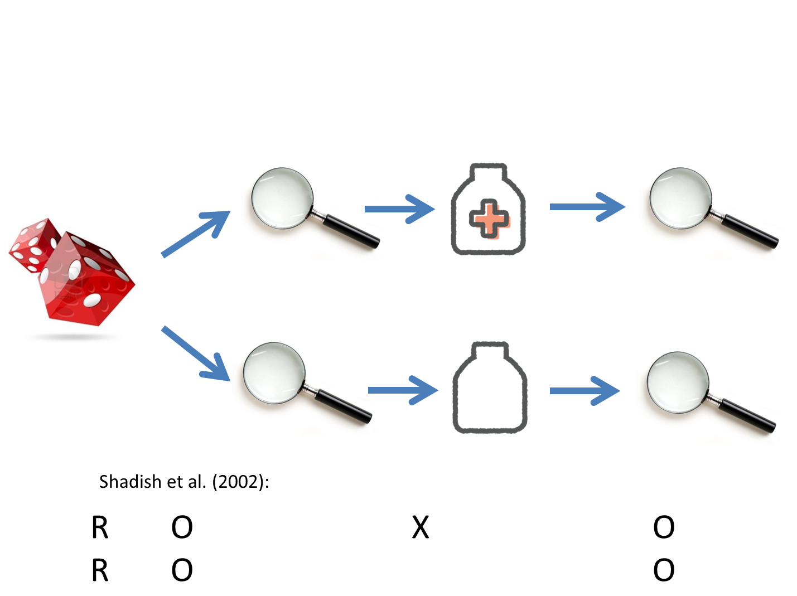

```{r setup, include=FALSE}
knitr::opts_chunk$set(echo = FALSE)
```

# What, where, when, why

What: 
Deliberative Polling

Where:

* Municipality of Bergen  
* Online

When: 
June 12, 2021

Why:
Main objective is practical.
Collaborate with local government and try out new forms of democratic participation to complement the representative selection procedure.


{height='100'}           {height='100'}  {height='200'}   {height='60'}   {height='200'}    {height='200'}

# Deliberative Polling

A [Deliberative Poll®](https://cdd.stanford.edu/) aims to show what the people would think if they opportunity to become more informed and more engaged by the issues in question.

## Key features

- Random sample

- 100-300 citizens discuss chosen topics and express their views in a survey

- Control group of similar size participates in same survey, but not in the deliberation

- Physical meetings most common, but online solutions possible (and necessary in the covid era)

<!-- # Deliberative Polling -->

<!-- [Deliberative Polling®](https://cdd.stanford.edu/)  is an attempt to use public opinion research in a new and constructive way. -->

<!-- The public has little reason to invest time and effort in acquiring information or coming to a considered judgment, and are as a result often uninformed about key public issues. -->

<!-- In a deliberative poll, the participants first take survey. -->
<!-- Then, the participants engage in dialogue with fellow citizens and competing experts. -->
<!-- After the deliberations, the sample is again asked the original questions.  -->
<!-- The resulting changes in opinion represent the conclusions the public would reach, *if people had opportunity to become more informed and more engaged by the issues*. -->

# Deliberative Polling

A [Deliberative Poll®](https://cdd.stanford.edu/) aims to show what the people would think if they opportunity to become more informed and more engaged by the issues in question.

## Key features

- Groups of 5-20 participants discuss political proposals, and weigh arguments for and against.
Group moderators ensure proper discussions, maintain progression, and make sure everyone has the opportunity to make their voice heard

- Panel debate with experts on the field, representing the breadth of opinions on the topic under discussion
Participants have the opportunity to ask questions.

- Duration: 1-2 days

Deliberative polling shares many features with other small scale participatory processes with other labels ('Citizen assembly', 'mini-publics', 'G1000', and more).
In Norwegian, we label such small scale participatory processes 'borgerpanel'.

# Background: Local democratic innovation in Bergen

- Former head of Council Harald Schelderup established a committee lead by Prof. Anne Lise Fimreite with the mandate to evaluate the health of democracy in Bergen.

{height='400'}

- [The report](https://www.bergen.kommune.no/publisering/api/filer/T540582721) recommended trying out alternative forms of participatory processes to complement representative democracy.

- An initial *borgerpanel* pilot was carried out in collaboration with the municipality of Bergen.

# *Borgerpanel* pilot

## Topic: decentralized local government in Bergen?

{height='600'} {height='600'}


# DEMOVATE project: Collaborative project between academia and local authorities

- The core aim to be addressed in the DEMOVATE project is to establish a well-functioning, legitimate, and politically relevant borgerpanel in the municipality of Bergen that can serve as a model for other municipalities in Norway.

- Financed by the Research Council of Norway (2019-2022).


# DEMOVATE project: Deliberative poll, 2021

## Preparations

Survey on citizens of Bergen to evaluate

  - What topics to choose
  
  - How to set up the deliberative poll to increase participation (incentives, length, etc)
  
{height='400'}

# Two topics chosen by the city

## 1. Re-development of the port area Dokken

```{r, out.width = "50%", fig.cap= "Dokken.", echo=FALSE}
knitr::include_graphics("C:/Users/svein/Documents/borgerpanel/Presentasjoner/Dokken.jpg")
```

* Should cruise ships remain in the city center or be moved out?

* Social housing or market based housing prices when city develops an entirely new residential area at Dokken?

* Should the sea front remain intact or be filled out to allow for larger areas to be developed?

# Two topics chosen by the city

## 2. Car-free zones in Bergen

```{r, out.width = "50%", fig.cap= "Bilfri sone på Møhlenpris. Foto: Lars Ove Kvalbein", echo=FALSE}
knitr::include_graphics("C:/Users/svein/Documents/borgerpanel/Informasjonsmateriale/Picture1.png")
```

* Should more parking spaces be reserved for car sharing companies at the expense of private cars?

* Should the residents in a local neighbourhood have a say in whether or not their area should become a car-free zone?


# Formal input into the political decision process

Results from the deliberative poll will be formally recognized and taken into account by the city council:

>Byrådsleder innstiller til byrådet å fatte følgende vedtak:
1. Program for bilfrie soner i bydelene og arealstrategi for Dokken brukes som
diskusjonstemaer i borgerpanelet.
2. Byrådet vil ta stilling til innspillene fra borgerpanelet i de politiske saksfremleggene som
følger sakene i vedtakspunkt 1, og innspillene skal være selvstendige vedlegg i
saksgrunnlaget frem mot endelig politisk behandling.

        - City Council decision, April 29, 2021

# First challenge: Covid-19

* Initial plan of physical gathering in April 2021 was impossible due to government restrictions followin the Covid-19 pandemic.

* Caused a two mont delay and the need to go online

## Adjusted timeline

```{r firefaser-setup, include=FALSE}
if(!require("haven")){install.packages("haven");  library(haven)}
if(!require("kableExtra")){install.packages("kableExtra");  library(kableExtra)}
if(!require("knitr")){install.packages("knitr");  library(knitr)}
if(!require("readxl")){install.packages("readxl");  library(readxl)}
if(!require("tidyverse")){install.packages("tidyverse");  library(tidyverse)}

d <- read_excel("DeliberativePoll-planning.xlsx")

knitr::opts_chunk$set(echo = FALSE, knitr.kable.NA = "", warning = FALSE, message = FALSE)
```

```{r dp-sodp-gantt, fig.width=9, fig.height=4}
#Gantt
gantt <- d %>% 
  filter(!is.na(Startdato)) %>% 
  pivot_longer(., Startdato:Sluttdato, names_to = "period") %>% 
  mutate(value = as.Date(value, "%Y.%m.%d"),
         Type = as_factor(Type))  

cbbPalette <- c("#000000", "#E69F00", "#56B4E9", "#009E73", "#F0E442", "#0072B2", "#D55E00", "#CC79A7")

plot1 <- 
  ggplot(gantt, aes(x=value, y=fct_reorder(Type, desc(Item)), group=Item, color=as_factor(Fase)))+
    geom_line(size = 3) +
  labs(x="Year", y=NULL, title="Deliberativ Meningsmåling, 2021") + 
  scale_colour_manual(values=cbbPalette) +
  labs(color = "Fase") +
     theme_light() +
  theme(axis.line.y=element_blank(),
                  axis.title.x=element_blank(),
                 axis.title.y=element_blank(),
                 axis.ticks.y=element_blank(),
                                  axis.line.x =element_blank(),
                 legend.position = "bottom"
                ) 
plot1
```

# Solution: Stanford Online Deliberation Platform (SODP)

The Online Deliberation Platform is a video discussion platform for groups of 8-15 people. 
The platform is designed to facilitate a structured and equitable conversation with better opportunity for participants to speak up. 
It is developed by the [Stanford Crowdsourced Democracy Team](https://voxpopuli.stanford.edu/) in collaboration with the [Center for Deliberative Democracy](https://cdd.stanford.edu/).

{height='500'}

# Challenge II: EU Data Protectionism

- Schrems II ruling of Summer 2020: No personal identifying data of EU/EEA citizens can be transferred outside that area.

- Using the SODP, the discussions during June 12th would temporarily be transferred to the secure servers at Stanford University. This is a breach of the Schrems II ruling. 

- After much back and forth between the project partners, we had to make a late switch to using Zoom.

# Research design

{height='700'}

# Recruitment

**Random draw** from the **population registry**, everyone 18 years of age and older. Close to perfect sampling frame of the population (i.e. inhabitants of Bergen.

*Main sample: 2500 persons*. 1250 invited to deliberative poll, and 1250 invited to survey only (control group).
*Reserve sample of 1500 persons* to be invited if needed.
**Total sample size is 4000**.


* First contact point:
Invitation letter by **regular mail**.

* Reminder by text message or new letter.

# Recruitment

## Registered participants

168 registered participants in control group (`r round(168*100/1250)` percent of the invited).

138 registered participants in deliberative poll (`r round(138*100/2750)` percent of the invited).

# Survey responses

Pre survey (control and treatment groups together): 
242 responses

Post survey currently still in the field

# Data to be analyzed

1. Sample of 4000 invited citizens

  - Representativeness of participants in deliberative poll  vs. invited sample, and vs. control group, respectively.
  
  - Who participates? (How) are they different from non-participants? Does deliberative polls reach a different group of citizens than those who already participate in elections?
  
2. Transcribed text from the day of the deliberation

  - Will be used to identify most prevalent topics discussed by the participants
  
3. Surveys

  - Post survey by participants in deliberative poll is the authoritative aggregate opinion that will be communicated to the city council.
  
  - Post dp survey will be compared against pre dp survey, and against control group survey
  
  - In addition to questions directly on the topic of Dokken and of car free zones, we will measure whether the participants increase their internal and external political efficacy. 
  Also, we will investigate whether they are more prone to accept political losses after they have deliberated.


